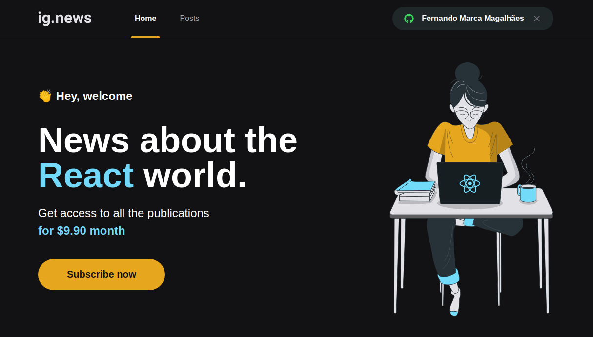
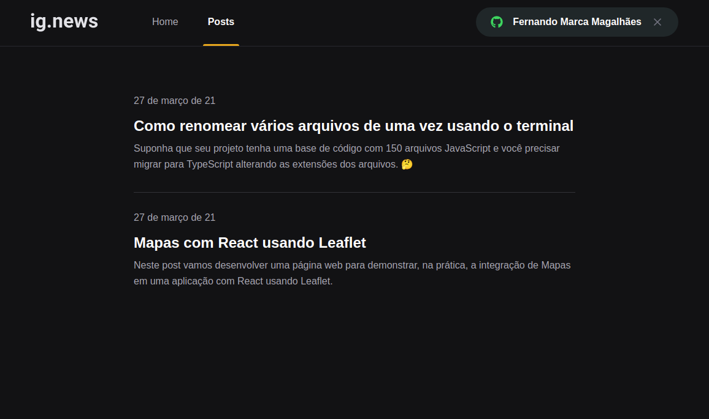

<h1>IgNews</h1>
Aplicação prática de um blog de notícias sobre o mundo React.
Desenvolvido durante o Ignite da rocketseat.

## 🚀 Tecnologias

Esse projeto foi desenvolvido com as seguintes tecnologias:

- [NextJs]
- [FaunaDb]
- [Prismic]
- [Stripe]

## 💻 Projeto

  <h4>Features:</h4>
  <ul>
    <li>Home page para inscrição e autenticação para acesso aos posts</li>
    <li>Página de Posts</li>
  </ul>

## 🔖 Layout

<table>
  <tr>
    <td><strong>Home</strong></td>
    <td><strong>Posts</strong></td>
  <tr>
   <tr>
    <td></td>
    <td></td>
  <tr>
</table>

## Licença

Esse projeto está sob a licença MIT.

Execute yarn install ou npm install para instalação.
